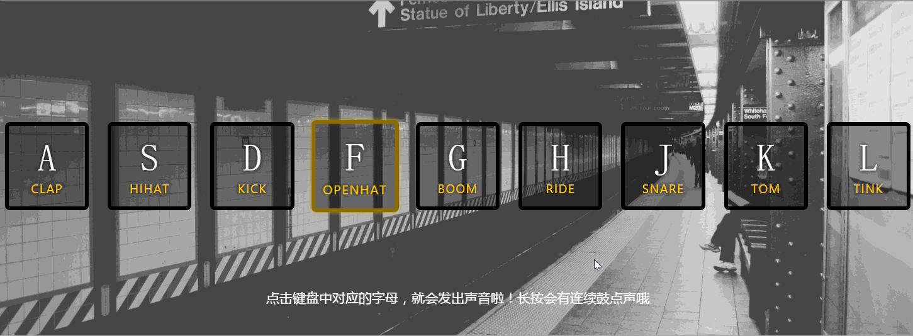

# 01 - JavaScript Drum Kit 

## 任务介绍

实现按下键盘 ASDFGHJKL 相应按键时，会发出对应鼓点的声音。

## 效果预览

[点击查看效果](https://miraclezys.github.io/JavaScript30/01%20-%20JavaScript%20Drum%20Kit/index-ME.html)

### 相关知识点

* [模板字符串](https://developer.mozilla.org/zh-CN/docs/Web/JavaScript/Reference/template_strings)
* [Document.querySelector()](https://developer.mozilla.org/en-US/docs/Web/API/Document/querySelector)
* [Document.querySelectorAll()](https://developer.mozilla.org/zh-CN/docs/Web/API/Document/querySelectorAll)
* [\<audio\>](https://developer.mozilla.org/zh-CN/docs/Web/HTML/Element/audio)
* [\<kbd\>](https://developer.mozilla.org/zh-CN/docs/Web/HTML/Element/kbd)

## 步骤

1. 给`window`添加`keydown`监听事件，即当键盘按下后，就会触发函数`playSound()`。

2. 实现键盘按下后的操作，即实现函数`playSound()`：

   1. 获取当前点击的键码(event.keyCode)
   2. 获取键码对应的`<audio>`
   3. 获取键码对应的`div.key`
   4. 如果当前点击的键码有对应的`<audio>`，那么给对应的`div.key`添加`classList.add("playing")`
   5. 播放音频

3. 为所有的`div.key`添加`transitioned`监听事件，`transitionend` 事件在 CSS 完成过渡后触发，即点击键盘后，触发选择器`.playing`的样式，等CSS完成过渡后，触发函数`removeTransition()`，即给对应的`div.key`移除`classList.remove("playing")`

   > 在键盘中点击对应的字母，该对应字母的`div.key`会有黄色框，当CSS完成过渡后，该黄色框会消失。黄色框的样式是`.playing`决定的。

   

## 问题

1. 如果保证长按后鼓点声音连续播放呢？

   在每次`<audio>`播放时，设置`<audio>`的开始时间戳为0

   ```javascript
   var audio = document.querySelector(`audio[data-key='${event.keyCode}']`);
   audio.currentTime = 0;
   audio.play();
   ```

2. 如何将键盘按下的字母与对应的`div.key`和`<audio>`相对应呢？

   ```html
   <div data-key="65" class="key">
     <kbd>A</kbd>
     <span class="sound">clap</span>
   </div>

   <audio data-key="65" src="sounds/clap.wav"></audio>
   ```

   可以看到每个对应的字母所对应的`div.key`和`<audio>`都有一个`data-key`的值，该`data-key`的值就是该字母对应的`keyCode`值。当键盘按下后，我们可以使用`event.target.keyCode`获取当前按下的`keyCode`值，就能获取对应的`div.key`和`<audio>`了：

   ```javascript
   var audio = document.querySelector(`audio[data-key='${event.keyCode}']`);
   var key = document.querySelector(`div[data-key='${event.keyCode}']`);
   ```

3. 如何判断哪个`div.key`需要取消黄色框的样式，即移除`classList.remove("playing")`？

   方法一：

   使用`propertyName`判断元素的属性是否改变了，比如点击了对应的字母，对应的`div.key`就会改变`transform`的值

   ```javascript
   if(event.propertyName !== "transform") return;
   event.target.classList.remove("playing");
   ```

   方法二：

   如果点击了对应的字母，对应的`div.key`添加`classList.add("playing")`，所以可以判断`div.key`是否有`calssName = playing`

   ```javascript
   var key = document.querySelector("div.playing");
   if(!key) return;
   key.classList.remove("playing");
   ```

   ​