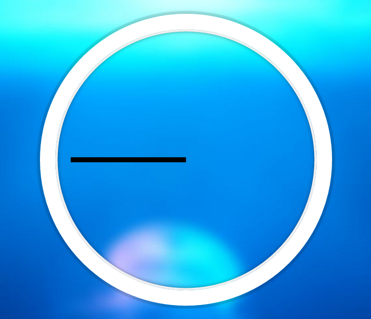
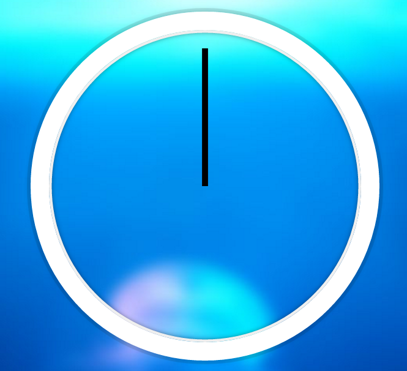

# 01 - JavaScript Drum Kit 

## 任务介绍

实现实时时钟。

## 效果预览

[点击查看效果](https://miraclezys.github.io/JavaScript30/02%20-%20JS%20and%20CSS%20Clock/index-ME.html)

### 相关知识点

* [window.setInterval](https://developer.mozilla.org/zh-CN/docs/Web/API/Window/setInterval)
* [transform-origin](https://developer.mozilla.org/zh-CN/docs/Web/CSS/transform-origin)
* [使用 CSS transitions](https://developer.mozilla.org/zh-CN/docs/Web/CSS/CSS_Transitions/Using_CSS_transitions)

## 步骤

1. 实时更新时针，分针，秒针的转动，即实现函数`setDate()`
   1. 获取当前时间
   2. 更改时针，分针，秒针的转动角度
2. 每一秒之后就调用一次函数`setDate()`


## 问题

1. 转动角度计算

   首先获取当前时间，接着获取当前秒数

   ```javascript
   var now = new Date();
   const seconds = now.getSeconds();
   ```

   那么对应的转动角度是

   ```javascript
   const secondsDegrees = (seconds / 60) * 360;
   ```

   因为时针，分针，秒针开始的起始角度是

   

   但是起始计算角度应为：

   

   所以秒针旋转的角度需要加上90度：

   ```javascript
   var now = new Date();
   const seconds = now.getSeconds();
   const secondsDegrees = (seconds / 60) * 360 + 90;
   secondHand.style.transform = `rotate(${secondsDegrees}deg)`;
   ```

   同理，分针和时针的转动角度也是这么计算的，不过分针的转动角度需要在基础上加上秒针的转动角度，时针的转动角度需要在基础上加上分针和秒针的转动角度。

   ```javascript
   const mins = now.getMinutes();
   const minsDegrees = (mins / 60) * 360 + ((seconds / 60) / 60) * 360 + 90;
   minHand.style.transform = `rotate(${minsDegrees}deg)`;

   const hours = now.getHours();
   const hoursDegrees = (hours / 12) * 360 + ((mins / 60) / 12) * 360 + ((seconds / 60) / 60 / 12) * 360 + 90;
   hourHand.style.transform = `rotate(${hoursDegrees}deg)`;
   ```

   ​