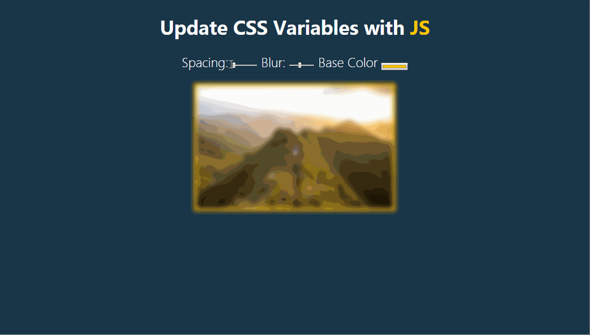

# 01 - JavaScript Drum Kit 

## 任务介绍

实现实时时钟。

## 效果预览

[点击查看效果](https://miraclezys.github.io/JavaScript30/03%20-%20CSS%20Variables/index-ME.html)



### 相关知识点

* [了解CSS/CSS3原生变量var](http://www.zhangxinxu.com/wordpress/2016/11/css-css3-variables-var/)
* [document.documentElement](https://developer.mozilla.org/zh-CN/docs/Web/API/Document/documentElement)
* [CSSStyleDeclaration.setProperty()](https://developer.mozilla.org/en-US/docs/Web/API/CSSStyleDeclaration/setProperty)
* [HTMLElement.dataset](https://developer.mozilla.org/zh-CN/docs/Web/API/HTMLElement/dataset)
* [:root](https://developer.mozilla.org/zh-CN/docs/Web/CSS/:root)

## 步骤

1. 添加属性

   1. 首先在根节点添加对应的自定义属性

      >  定义的语法：`--*`，*指的是变量名 


   2. 给对应的``和`.hl`添加对应的属性

      > 使用的语法：`var(--*)`，*指的是变量名

3. 给对应的`<input>`添加`change`和`mousemove`事件，当`<input>`的值改变时，修改对应属性的值


## 问题

1. 为什么要使用自定义属性呢？

   因为用起来方便啊(我是这么认为的٩(๑❛ᴗ❛๑)۶)。

   比如在根元素上定义了如下属性：

   ```css
   :root {
     --spacing: 10px;
     --blur: 10px;
     --base: #ffc600;
   }
   ```

   然后应用在了``和`.hl`上：

   ```css
   img {
     padding: var(--spacing);
     filter: blur(var(--blur));
     background-color: var(--base);
   }

   .hl {
     color: var(--base);
   }
   ```

   我们可以看到，``的`background-color`和`.hl`的`color`使用的是同一个值`var(--base)`。那么当我们想修改``的`background-color`的值的时候，`.hl`的`color`的值也是需要修改的，这样就很麻烦了，特别是数量多的时候。

   如果使用的是自定义属性，我们在根元素中定义了`--base`，然后``的`background-color`和`.hl`的`color`使用的值时`var(--base)`，如果我们想要修改``的`background-color`，我们只需要修改根元素上的`--base`的值，``的`background-color`和`.hl`的`color`就会跟着改变，是不是特别方便！

   ​

2. 如何在拖动滑块时，图片效果同步改变？

   给对应的`<input>`添加`mousemove`事件，当`<input>`的值改变时，修改对应属性的值