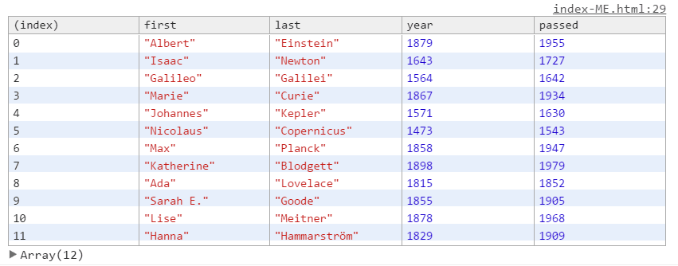

# 04 - Array Cardio Day 1

## 任务介绍

熟悉Array的几个方法

## 效果预览

[点击查看效果](https://miraclezys.github.io/JavaScript30/04%20-%20Array%20Cardio%20Day%201/index-ME.html)

### 相关知识点

* [Array.prototype.map()](https://developer.mozilla.org/zh-CN/docs/Web/JavaScript/Reference/Global_Objects/Array/map)
* [Array.prototype.filter()](https://developer.mozilla.org/zh-CN/docs/Web/JavaScript/Reference/Global_Objects/Array/filter)
* [Array.prototype.reduce()](https://developer.mozilla.org/zh-CN/docs/Web/JavaScript/Reference/Global_Objects/Array/Reduce)
* [Array.prototype.sort()](https://developer.mozilla.org/zh-CN/docs/Web/JavaScript/Reference/Global_Objects/Array/sort)
* [String.prototype.includes()](https://developer.mozilla.org/zh-CN/docs/Web/JavaScript/Reference/Global_Objects/String/includes)

## 步骤

> 认真看一下上面的几个方法就能做出来啦

1. 找出16世纪出生的发明家
2. 展示发明家的`first name`和`last name`
3. 按照发明家的出生年份排序，出生年份越早越靠前
4. 发明家们一共活了多少年
5. 按照发明家活的时间排序，活得越久越靠前
6. 筛选`https://en.wikipedia.org/wiki/Category:Boulevards_in_Paris`中的数据，找出大道名字包含`de`的大道列表
7. 根据`people`的`last name`进行排序
8. 统计`data`中每种种类的总数

## 小tips

如果需要输出数组查看结果，并且数组的每项还拥有多个属性，那么使用`console.table()`查看结果会更加直观。

例子：

```javascript
const inventors = [
      { first: 'Albert', last: 'Einstein', year: 1879, passed: 1955 },
      { first: 'Isaac', last: 'Newton', year: 1643, passed: 1727 },
      { first: 'Galileo', last: 'Galilei', year: 1564, passed: 1642 },
      { first: 'Marie', last: 'Curie', year: 1867, passed: 1934 },
      { first: 'Johannes', last: 'Kepler', year: 1571, passed: 1630 },
      { first: 'Nicolaus', last: 'Copernicus', year: 1473, passed: 1543 },
      { first: 'Max', last: 'Planck', year: 1858, passed: 1947 },
      { first: 'Katherine', last: 'Blodgett', year: 1898, passed: 1979 },
      { first: 'Ada', last: 'Lovelace', year: 1815, passed: 1852 },
      { first: 'Sarah E.', last: 'Goode', year: 1855, passed: 1905 },
      { first: 'Lise', last: 'Meitner', year: 1878, passed: 1968 },
      { first: 'Hanna', last: 'Hammarström', year: 1829, passed: 1909 }
    ];
console.table(inventors);
```

输出结果：



