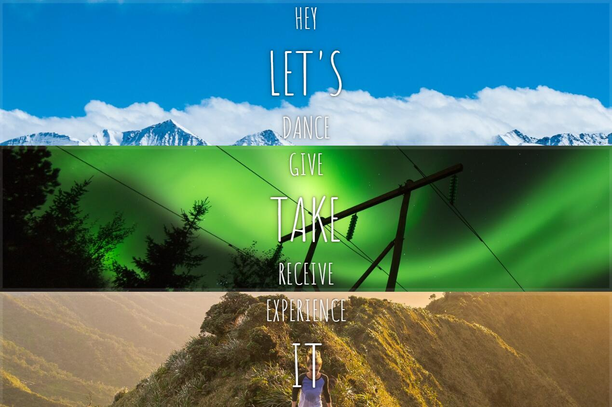
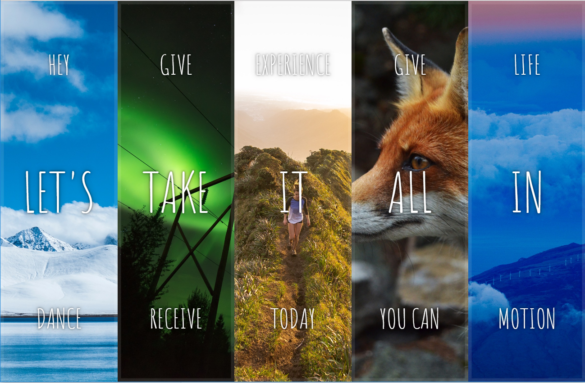
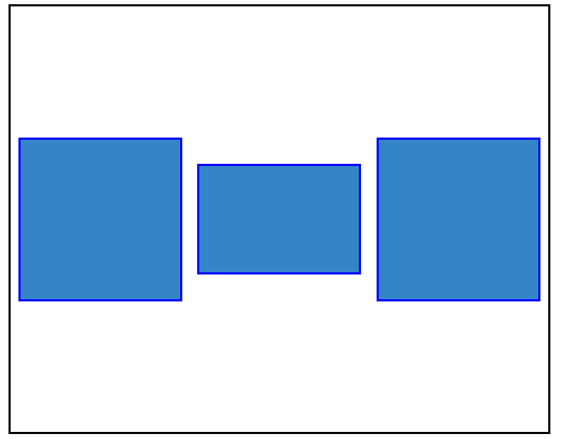
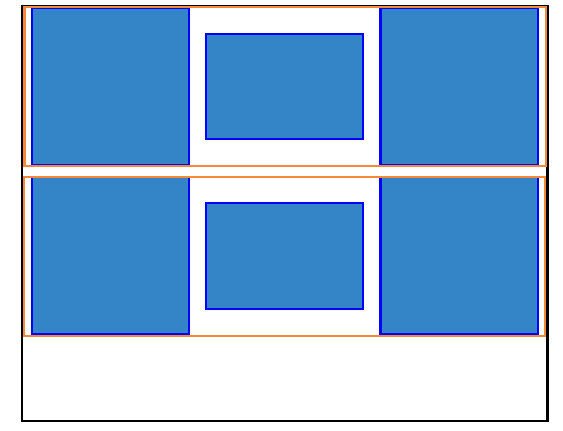

# 05 - Flex Panel Gallery

## 任务介绍

使用Flex完成布局，实现点击对应图片有图片打开的动画效果，再点击有图片关闭的动画效果。

## 效果预览

[点击查看效果](https://miraclezys.github.io/JavaScript30/05%20-%20Flex%20Panel%20Gallery/index-ME.html)


### 相关知识点

* [Flex 布局教程：语法篇](http://www.ruanyifeng.com/blog/2015/07/flex-grammar.html)
* [Flex 布局教程：实例篇](http://www.ruanyifeng.com/blog/2015/07/flex-examples.html)
* [Element.classList](https://developer.mozilla.org/zh-CN/docs/Web/API/Element/classList)

## 步骤

> 首先需要认真看Flex布局相关内容哦

1. 一开始的页面是这样的：

   

   所以我们首先要将它们变成横向分布：

   1. 首先，我们将图片改成横向分布：

      ```css
      .panels {
      	display: flex;
      }

      .panel {
      	flex: 1；
      }
      ```

      

   2. 让图片中的字体居中

      ```css
      .panel {
          flex: 1;
          display: flex;
          flex-direction: column;
          justify-content: center;
      }

      .panel > * {
          flex: 1;
          display: flex;
          justify-content: center;
          align-items: center;
      }
      ```

      

   3. 使第一行字体和第三行字体不在屏幕上，当点击时才出现:

      ```css
      .panel > *:first-child {
      	transform: translateY(-100%);
      }

      .panel.open-active > *:first-child {
      	transform: translateY(0);
      }

      .panel > *:last-child {
      	transform: translateY(100%);
      }

      .panel.open-active > *:last-child {
      	transform: translateY(0);
      }
      ```

   4. 修改`.open`样式，`.open`是当图片被点击时的样式：

      图片所占据的位置变大，字号也有所增大。

      ```css
      .panel.open {
      	flex: 5;
      	font-size:40px;
      }
      ```

   5. 给每个`.panel`增加`click`和`transitionend`事件

      1. 当点击图片时，给`.panel`的`classList`增加`.open`，即图片所占据的位置增大，字号也增大
      2. 当transitionend 事件会在 [CSS transition](https://developer.mozilla.org/zh-CN/docs/Web/CSS/CSS_Transitions/Using_CSS_transitions) 给`.panel`的`classList`增加`.open-active`，即第一行和第三行字体显示出来

## 问题

1. 如何实现点击图片时有图片打开的动画效果，再点击时，图片有关闭的动画效果呢？

   其实我们可以将问题理解为，第一次点击图片时，`.panel`的`classsList`增加了`.open`和`.open-active`，当再次点击图片时，`.open`和`.open-active`从`.panel`的`classList`移除了。

   如果使用一个标记字符串也能很容易完成这个效果，但是我们可以使用[`classList.toggle()`](https://developer.mozilla.org/zh-CN/docs/Web/API/Element/classList)更简便的完成：

   语法：

   **toggle** ( String [, force] )

   * 当只有一个参数时：切换 class value; 即如果类存在，则删除它并返回false，如果不存在，则添加它并返回true。
   * 当存在第二个参数时：如果第二个参数的计算结果为true，则添加指定的类值，如果计算结果为false，则删除它


## 小tips

1. 可能你在看文档的时候会有所困惑，`align-items`和`align-content`有什么区别呢？

   > [参考资料](http://stackoverflow.com/questions/31250174/css-flexbox-difference-between-align-items-and-align-content)

   简单的说，`align-items`是让**每一个单行**的flex容器设置对齐效果，而`align-content`是对**多行**的flex容器设置对齐效果。如果flex容器只有一行，设置`align-content`是没有效果的，具体的你可以动手试试哦。

   简单的小实验：

   ```html
   <div class="main">
     <div class="div1"></div>
     <div class="div2"></div>
     <div class="div3"></div>
   </div>
   ```

   ```css
   .main {
     display: flex;
     align-items: center;
     align-content: flex-start;
     justify-content: space-around;
   }

   .main > div{
     width: 150px;
     border: 2px solid blue;
   }
   ```

   由于只有一行，此时你会发现设置了`align-content: flex-start`是没有作用的，因为该行没有在交叉轴上以交叉轴的起点对齐。而`align-items: center`起了作用，因为该行中的每个项目，以交叉轴的中点对齐。

   

   下面我们加多几个项目:

   ```html
   <div class="main">
       <div class="div1"></div>
       <div class="div2"></div>
       <div class="div3"></div>
       <div class="div1"></div>
       <div class="div2"></div>
       <div class="div3"></div>
   </div>
   ```

   ```css
   .main {
       display: flex;
       align-items: center;
       align-content: flex-start;
       justify-content: space-around;
       flex-wrap: wrap;
   }
   ```

   我们可以看到，每一行中的项目，在交叉轴上是以该行的中点对齐的，这是`align-items: center`所起的作用。而把两行看做整体，在交叉轴上是以交叉轴的起点对齐的，这是`align-content: flex-start`起的作用。



​	

​	