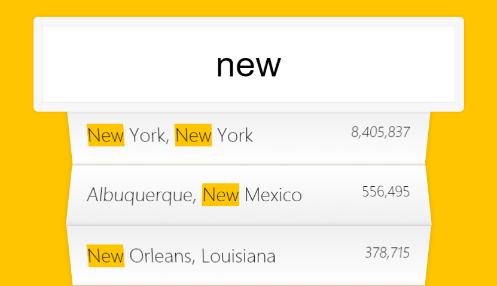

# 06 - Type Ahead

## 任务介绍

在输入框输入搜索内容，马上显示搜索结果

## 效果预览

[点击查看效果](https://miraclezys.github.io/JavaScript30/06%20-%20Type%20Ahead/index-ME.html)

### 相关知识点

* [Fetch API](https://developer.mozilla.org/zh-CN/docs/Web/API/Fetch_API)
* [深入浅出Fetch API](http://web.jobbole.com/84924/)
* [Promise.prototype.then()](https://developer.mozilla.org/zh-CN/docs/Web/JavaScript/Reference/Global_Objects/Promise/then)
* [Array.prototype.join()](https://developer.mozilla.org/en-US/docs/Web/JavaScript/Reference/Global_Objects/Array/join?v=example)
* [扩展语句](https://developer.mozilla.org/zh-CN/docs/Web/JavaScript/Reference/Operators/Spread_operator)
* [正则表达式30分钟入门教程](http://deerchao.net/tutorials/regex/regex.htm)

## 步骤

1. 首先我们需要获取`endpoint`的内容

   ```javascript
   const endpoint = 'https://gist.githubusercontent.com/Miserlou/c5cd8364bf9b2420bb29/raw/2bf258763cdddd704f8ffd3ea9a3e81d25e2c6f6/cities.json';
   ```

   将`endpoint`传递给全局的`fetch()`方法，它会返回一个`Promise`。当`Promise`被通过了，会返回一个`Response`对象（对应代码中的`blob`），通过该对象的`json()`方法可以将结果作为`JSON`对象返回。`response.json()`也会返回一个`Promise`对象，因此我们可以使用`then()`方法将返回的带有`JSON`数据的对象赋值给数组`cities`。

   ```javascript
   const endpoint = 'https://gist.githubusercontent.com/Miserlou/c5cd8364bf9b2420bb29/raw/2bf258763cdddd704f8ffd3ea9a3e81d25e2c6f6/cities.json';

   let cities = [];

   fetch(endpoint).then(blob => blob.json()).then(data => cities.push(...data));
   ```

2. 找出数组`cities`中与输入的字符串匹配项，即实现函数`findMatches()`

3. 对结果进行展示，即实现函数`displayMatches()`

   1. 显示的人口的格式是，每三位需要添加逗号，比如需要显示`1000000`，显示的结果是`1,000,100`，所以需要实现函数`numberWithCommas()`

      

   2. 注意显示的结果中，要对输入的搜索字符串定义黄色背景颜色，由于在样式中已经定义了`<span class='hl'>`的背景颜色，所以只需要对选中的结果添加`<span class="hl">${this.value}</span>`就好啦

4. 最后就是给输入框添加事件`change`和`keyup`，当事件类型触发时，执行函数`displayMatches()`

   ​


## 小tips

1. 如果较为简便的给搜索匹配结果添加黄色背景颜色，对应样式是`<span class="hl">`?

   方法如下：

   ```javascript
   const cityName = place.city.replace(regex, `<span class="hl">${this.value}</span>`);
   const stateName = place.state.replace(regex, `<span class="hl">${this.value}</span>`);
   ```

2. 函数`numberWithCommas()`如何实现？

   ```javascript
   function numberWithCommas(x) {
     return x.toString().replace(/\B(?=(\d{3})+(?!\d))/g, ',');
   }
   ```

   `/\B(?=(\d{3})+(?!\d))/g`指的是匹配非单词边界并且以三个数字为一组

   `\B`：匹配非单词边界

   `\d{3}`：数字出现了3次

   `(\d{3})+`：三个数字为一组，至少出现了一组（就是出现的数字的个数是3的倍数）

   `(?!\d)`：接下来的字符不是数字

   `(\d{3})+(?!\d)` ：接下来的字符需要符合出现的数字的个数是3的倍数，并且最后一位不是数字

   `(?=(\d{3})+(?!\d))`：接下来的字符需要匹配[符合出现的数字的个数是3的倍数，并且最后一位不是数字]的前面部分。

   这个可能有点难理解，举个例子，比如`\b\w+(?=Script\b)`，匹配以script结尾的单词的前面部分(即不包括Script)，如JavaScript，它会匹配Java。

   所以，`/\B(?=(\d{3})+(?!\d))/`的意思是匹配的字符是非单词边界，并且该匹配字符的后面是[出现的数字的个数是3的倍数，并且最后一位不是数字]

   举个例子，比如1234567，与`/(\d{3})+(?!\d)/`匹配，匹配的字符串是234567，那么与`/\B(?=(\d{3})+(?!\d))/`匹配的是1和2之间的位置，所以我们使用`"1234567".replace(/\B(?=(\d{3})+(?!\d))/,',')`得到的结果是`1,234567`，如果想接着匹配，那么在正则表达式最后加上全局匹配`g`，即`"1234567".replace(/\B(?=(\d{3})+(?!\d))/g,',')`，最后得到的结果就是`1,234,567`啦。

