# 09 - Dev Tools Domination

## 任务介绍

介绍一些调试技巧

## 效果预览

[点击查看效果](https://miraclezys.github.io/JavaScript30/09%20-%20Dev%20Tools%20Domination/index-ME.html)

### 相关知识点

* [console](https://developer.mozilla.org/zh-CN/docs/Web/API/Console)

## 步骤

1. 可以使用Chrome的断点调试

   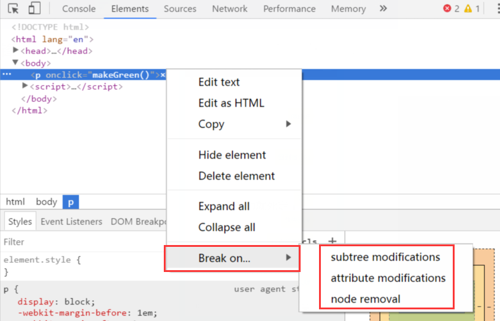

   当JavaaScript尝试改变DOM元素时，给元素添加的断点便会触发。

   * Subtree Modifications：当添加，改变，删除子元素时触
   * Attributes Modifications：当元素属性被改变时触发
   * Node Removal：当移除元素时触发

   比如我给上图中的`<p>`添加了Attributes Modifications断点，当我点击该元素时，就会执行函数`makeGreen()`，因为函数`makeGreen()`会修改`<p>`的属性，所以就会触发了断点：

   可以看到页面中会清晰的出现哪一行代码修改了`<p>`的属性：

   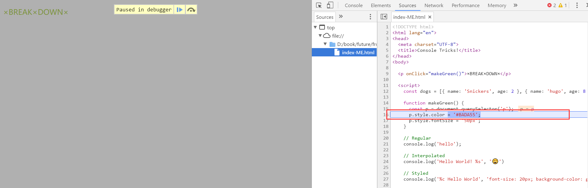

   如果点击如下按钮，就可以让代码执行下一步：

   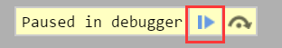

2. 我们通常使用`console.log()`调试

   ```javascript
   console.log('hello');
   ```

   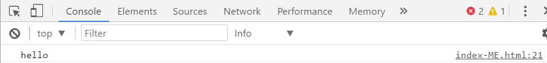

3. `console.log()`可以使用变量作为参数传递到字符串中。

   其具体语法与C语言中的`printf()`语法一致：

   ```
   console.log('Hello World! %s', '😄');
   console.log("%s is %d years old.", "Bob", 42);
   ```

   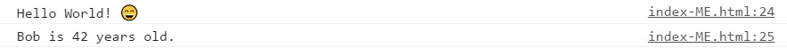

4. 可以给`console.log()`输出的结果添加样式：

   ```javascript
   console.log('%c Hello World', 'font-size: 20px; background-color: gray; text-shadow: 10px 10px 0 red');
   ```

   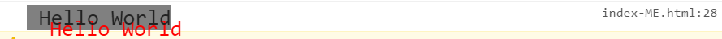

5. 使用`console.warn()`输出警告信息：

   ```javascript
   console.warn('NO! NO! NO!');
   ```

   

6. 使用`console.error()`输出错误信息：

   ```javascript
   console.error('ERROR!');
   ```

   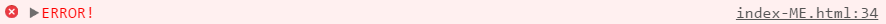

7. 使用`console.info()`打印以感叹号字符开始的提示信息

   ```javascript
   console.info('Hello World!');
   ```

   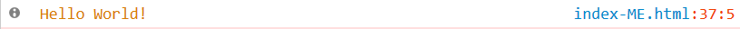

8. 使用`console.assert()`判断第一个参数是否为真，false的话抛出异常并且在控制台输出相应信息，true的话什么也不做

   ```javascript
   const p = document.querySelector('p');
   console.assert(p.classList.contains('hello'), 'That is wrong!');
   ```

   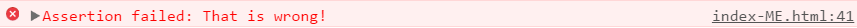

9. 使用`console.clear()`清空控制台的消息

   ```javascript
   console.clear();
   ```

10. 使用`console.log()`输出元素`<p>`

    ```javascript
    const p = document.querySelector('p');
    console.log(p);
    ```

    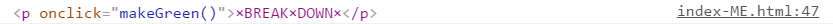

    使用`console.dir()`输出元素`<p>`，可以与上面的结果对比一下。输出结果会将一个`<p>`对象的属性和属性值显示成一个可交互的列表，点击折叠的小三角形可以查看各子属性的内容.

    ```javascript
    console.dir(p);
    ```

    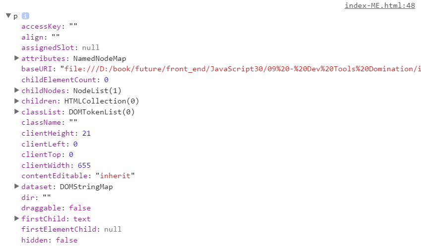

    (截图没有只截取了部分输出结果，详细输出可以在控制台查看哦)

11. 使用`console.group()`和`console.groupEnd()`在 [Web控制台](https://developer.mozilla.org/zh-cn/Tools/Web_Console)上创建一个新的分组。随后输出到控制台上的内容就会进行分组，直到调用`console.groupEnd()`之后，表示当前分组结束。

    ```javascript
     dogs.forEach(dog => {
          console.groupCollapsed(`${dog.name}`);
          console.log(`This is ${dog,name}`);
          console.log(`${dog.name} is ${dog.age} years old.`);
          console.groupEnd(`${dog.name}`);
    });
    ```

    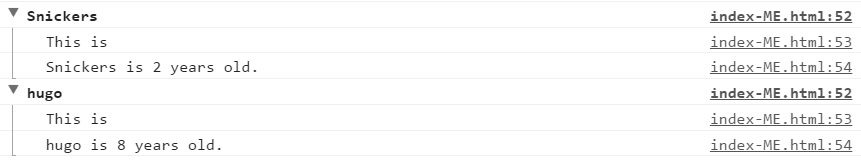

12. 使用`console.count()`以参数为标识记录调用的次数，调用时会在控制台打印标识以及调用次数。

    ```javascript
    console.count('A');
    console.count('A');
    console.count('B');
    console.count('A');
    console.count('A');
    console.count('B');
    console.count('B');
    console.count('A');
    console.count('B');
    ```

    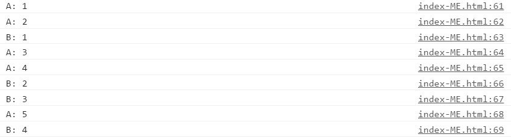

13. 使用`console.time()`启动一个计时器来跟踪某个操作的时间，当调用`console.timeEnd()`时，以毫秒为单位输出计时器经过的时间

    ```javascript
    console.time('fetching data');
    fetch('https://api.github.com/users/wesbos')
        .then(data => data.json())
        .then(data => {
            console.timeEnd('fetching data');
            console.log(data);
    })	
    ```

    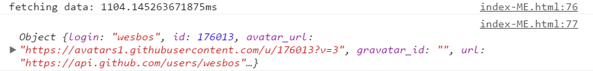

    ​