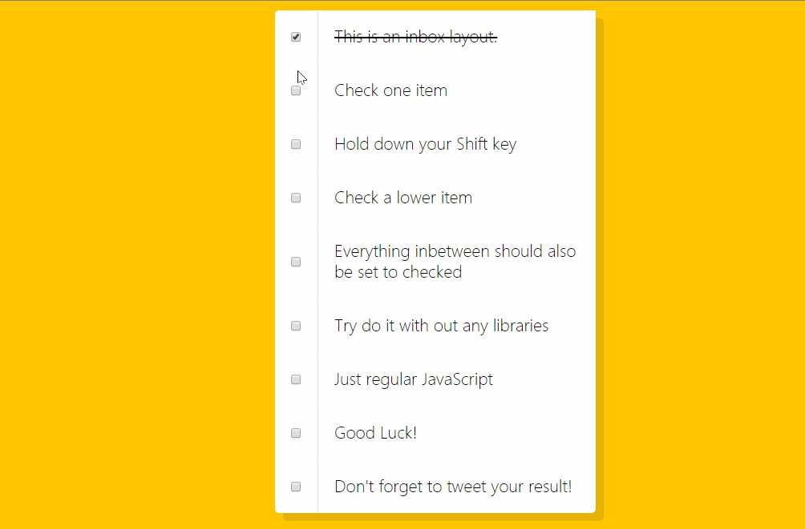

# 08 - Fun with HTML5 Canvas

## 任务介绍

使用Canvas实现彩虹画笔

## 效果预览

[点击查看效果](https://miraclezys.github.io/JavaScript30/08%20-%20Fun%20with%20HTML5%20Canvas/index-ME.html)



（这个是我随便画的，你可以用来创作好看的图案哦）

### 相关知识点

* [Canvas教程](https://developer.mozilla.org/zh-CN/docs/Web/API/Canvas_API/Tutorial)
* [\<color>](https://developer.mozilla.org/zh-CN/docs/Web/CSS/color_value#hsl())
* [HSL在线查看](http://hslpicker.com/)

## 步骤

> 最好先看一下上面那个canvas教程哦

1. 首先将`canvas`的高度和宽度设为浏览器窗口的视口的宽度`window.innerWidth`和高度`window.innerHeight`

2. 起初`canvas`是空白的，我们需要找到它的渲染上下文，然后在`canvas`上进行绘制。我们可以使用`getContext()`方法用来获取渲染上下文和它的绘画功能

   ```javascript
   const ctx = canvas.getContext('2d');
   ```

3. 定义初始值

   * `strokeStyle`：画笔颜色
   * `lineWidth` ：画笔粗细
   * `lineJoin`：用于设置两个长度不为0的相连部分
   * `lineCap`：用于设置如何绘制一条线段末端的属性

4. 画笔的实现，即实现函数`draw()`

   画笔有两个特点：

   1. 画笔颜色呈彩虹色变化
   2. 画笔大小从粗到细，再由细到粗以此类推

   生成路径的步骤：

   1. `beginPath()`：路径是由很多子路径构成，这些子路径都在一个列表中，所有子路径（线，弧形等等）构成图形。而每次这个方法调用之后，列表清空重置，然后就可以重新绘制新的图形
   2. `moveTo()` ：在设置路径之后专门指定路径的起始位置
   3. `lineTo(x, y)` ：绘制一条从当前位置到指定x以及y位置的直线
   4. `stroke()` ：绘制`moveTo()`到`lineTo()`的路径

5. 添加对应的事件

   1. 鼠标按下时，即`mousedown`事件，需要更新路径的起始位置，即`moveTo()`需要用到的参数
   2. 鼠标在移动时，即`mousemove`时间将，画笔开始绘制，即调用函数`draw()`
   3. 鼠标松开时，或鼠标移出了视口范围，即`mouseup`和`mouseout`，画笔停止绘制

## 问题

1. 如何实现彩虹色的画笔？

   我们可以使用函数`hsl()`定义`strokeStyle`的值。

   函数`hsl()`对应的三个参数的值是色相-饱和度-明度，我们将饱和度和明度的值设为100%和50%，动态修改色相的值

   

   我们可以看到，色相的范围是`0~360`，我们只需要定义色相的值初始值为`0`，每次调用`draw()`函数就将色相的值加一，当色相的值大于`360`时，再重新赋值为`0`，就能实现画笔颜色的变化了。

2. 如何实现画笔大小的变化？

   这比修改画笔颜色简单得多了。

   1. 首先定义画笔大小为1，画笔递增的方向为`true` 。
   2. 每次调用`draw()`函数，并且画笔递增的方向为`true` ，画笔大小加一。
   3. 当画笔大小的值大于`100`时，画笔递增的方向改为`false` 。
   4. 每次调用`draw()`函数，并且画笔递增的方向为`false` ，画笔大小减一。
   5. 当画笔大小的值小于`1`时，画笔递增的方向改为`true` 。

   ```javascript
   if(ctx.lineWidth >= 100 || ctx.lineWidth <=1) {
   	direction = !direction;
   }

   if(direction) {
   	ctx.lineWidth++;
   }
   else {
   	ctx.lineWidth--;
   }
   ```

3. 更新`moveTo()`参数

   `moveTo(lastX, lastY)`参数是定义路径的起始位置，我们需要在两个地方更新它：

   * 当鼠标按下时，表示开始绘画，此时需要更新`lastX`和`lastY`
   * 每次调用`draw()`函数时，代表正在绘画，此时在路径绘制结束后，即`stroke()`函数后，更新`lastX`和`lastY`，这样才能将线条连接起来。可以理解为一条路径是由很多子路径构成的。

