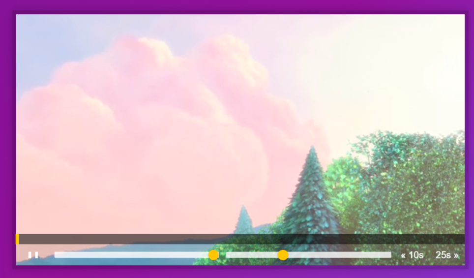

# 11 - Custom Video Player

## 任务介绍

 实现一个简单的视频播放器，需要实现以下功能：

* 点击视频可以暂停或播放，并且播放按钮状态会进行切换
* 可以通过拖动修改视频的进度，实时更新视频的播放进度条
* 可以通过拖动修改视频的声音
* 可以通过拖动修改视频的播放进度
* 可以通过点击使得视频的播放进度快进或后退

## 效果预览

[点击查看效果](https://miraclezys.github.io/JavaScript30/11%20-%20Custom%20Video%20Player/index.html)




## 步骤

1. `video` ： 视频

   * 在视频暂停`pause`或播放`play`时，需要更新播放按钮的状态。

     事件触发时执行的函数是`updateButton()`

     ```javascript
     function updateButton() {
     	const method = video.paused? '►' : '❚ ❚';
     	toggle.textContent = method;
     }
     ```

   * 在点击视频`click`时，切换视频的播放状态：

     * 如果正在播放，那么点击视频时，视频暂停。
     * 如果视频已暂停，那么点击视频时，视频播放。

     事件触发时执行的函数是`togglePlay()`

     ```javascript
     function togglePlay() {
     	const method = video.paused? 'play' : 'pause';
     	video[method]();
     }
     ```

   * 当视频的播放位置发生改变`timeupdate`时，更新播放条的长度。

     事件触发时执行的函数是`handleProgress()`

     ```javascript
     function handleProgress() {
     	const present = (video.currentTime / video.duration) * 100;
     	progressBar.style.flexBasis = `${present}%`;
     }
     ```

2. `toggle` ：播放、暂停按钮

   * 当该按钮被点击时，切换视频的状态。

     * 如果视频正在播放，那么点击按钮，视频暂停。
     * 如果视频已暂停，那么点击按钮，视频播放。

     事件触发时执行的函数是`togglePlay()`

3. `skipButton` ：前进10s，后退25s按钮

   * 当点击该按钮`click`时，修改视频当前播放的事件：

     * 如果点击前进10s，视频当前播放时间 -10s
     * 如果点击后退25s，视频当前播放时间 +25s

     事件触发时执行的函数是`skip()`

     ```javascript
     function skip() {
     	video.currentTime += parseFloat(this.dataset.skip);
     }
     ```

4. `ranges` ：修改视频声音大小和播放速度的进度条

   * 当点击修改声音的进度条时，事件`change`和`mousemove` ，将视频的声音大小修改为当前进度条的值。

     事件触发时执行的函数是`handleRangeUpdate()`

     ```javascript
     function handleRangeUpdate() {
     	video[this.name] = this.value;
     }
     ```

   * 当点击修改播放速度的进度条时，事件`change`和`mousemove` ，将视频的播放速度修改为当前进度条的值。

     事件触发时执行的函数是`handleRangeUpdate()`

5. `progress` ：视频播放进度的进度条

   * 当点击进度条`click`时，将视频当前播放位置调整到进度条点击的位置。

     事件触发时执行的函数是`scrub()`

     ```javascript
     function scrub(event) {
     	const scrbTime = (event.offsetX / progress.offsetWidth) * video.duration;
     	video.currentTime = scrbTime;
     }
     ```

   * 当鼠标按下时，移动视频播放进度条，更新视频当前的播放位置

     首先需要一个标记为`mousedown = false`来记录当前鼠标是否按下：

     * 如果鼠标按下`mousedown`，那么`mousedown = true`

     * 如果鼠标放开`mouseup` ，那么`mousedown = false`

     * 如果当前鼠标按下并移动了进度条`mousemove` ，更新视频当前的播放位置。

       事件触发时执行的函数是`scrub()`


## 奇妙之处

1. 什么时候需要更新播放按钮状态（图标）`toggle`？

   1. 当播放按钮被点击的时候
   2. 当视频被点击的时候
      - 如果正在播放，那么点击视频时，视频暂停。
      - 如果视频已暂停，那么点击视频时，视频播放。

   所以播放按钮状态改变取决于视频当前的状态，如果视频正在播放，那么按钮是暂停的图标。如果视频正在暂停，那么按钮是播放的图标。

   所以我们可以当视频的`play`和`pause`事件触发时，执行函数`updateButton`，而不需要在点击按钮时触发函数。点击按钮时，修改视频状态就好啦。

2. 什么时候需要更新播放进度条？

   当视频当前播放位置发生改变时，所以我当视频的`timeupdate`事件触发时，执行函数`handleProgress()`。而当我们拖动进度条时，直接修改视频当前播放时间，就会触发视频的`timeupdate`事件，执行函数`handleProgress()` ，从而修改视频的播放进度条。

## 小tips

可以增加点击键盘上的左右箭头，实现前进或后退的功能哦

```javascript
function keyChange(event) {
	console.log(event.keyCode);
	switch(event.keyCode) {
		case 39:
			video.currentTime += 25;
		case 37:
			video.currentTime -= 10;
		default:
			return;
	};
}

window.addEventListener('keydown', keyChange);
```

本来还想实现点击空格键原本播放的视频暂停的，但是发现浏览器已经自身实现了。