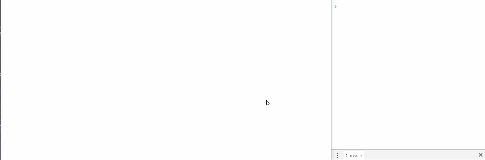

# 12 - Key Sequence Detection

## 任务介绍

对键盘输入的序列进行验证

## 效果预览

[点击查看效果](https://miraclezys.github.io/JavaScript30/12%20-%20Key%20Sequence%20Detection/index-ME.html)

比如验证字符是hello，当正确输入了hello，控制台就会显示DING DING!，表示验证成功，并且屏幕上会增加一个图案哦。



## 相关知识点

* [Array.prototype.splice()](https://developer.mozilla.org/zh-CN/docs/Web/JavaScript/Reference/Global_Objects/Array/splice)

## 步骤

1. 首先我们定义我们需要验证的序列为`secretCode = 'hello'`
2. 用数组`pressed`保存当前用户输入的序列
3. 我们给`window`添加事件`keyup`的监听器，当该事件触发时，执行函数：
   1. 把输入的字符添加到数组`pressed`的末尾
   2. 从前面开始删除数组`pressed`的字符，即数组`pressed`上保存最新输入的长度为`secretCode.length`的字符串
   3. 判断数组`pressed`上是否包含了`secretCode`的字符序列
      * 如果包含，那么在控制台输出“DING DING!”，并且调用函数`cornify_add()`，在屏幕上增加一个图案。函数具体的效果可以[点击这里看哦](https://www.cornify.com)
   4. 输出当前的数组`pressed`


```javascript
const pressed = [];
const srcretCode = "hello";

window.addEventListener('keyup', (event) => {
	console.log(event.key);
	pressed.push(event.key);
	pressed.splice(-srcretCode.length - 1, pressed.length - srcretCode.length);
	if(pressed.join('').includes(srcretCode)) {
		console.log('DING DING!');
		cornify_add();
	}
	console.log(pressed);
})
```

