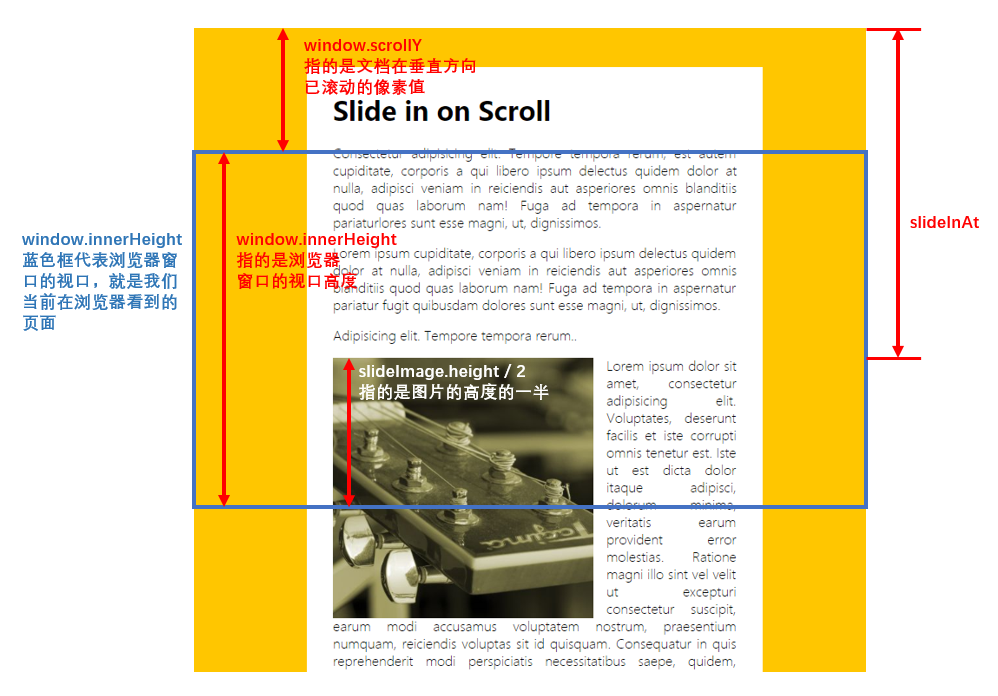

# 13 - Slide in on Scroll

## 任务介绍

实现滚动时图片轮播的效果

## 效果预览

[点击查看效果](https://miraclezys.github.io/JavaScript30/13%20-%20Slide%20in%20on%20Scroll/index-ME.html)


## 相关知识点

* [HTMLElement.offsetTop](https://developer.mozilla.org/zh-CN/docs/Web/API/HTMLElement/offsetTop)
* [Window.scrollY](https://developer.mozilla.org/zh-CN/docs/Web/API/Window/scrollY)
* [Window.innerHeight](https://developer.mozilla.org/zh-CN/docs/Web/API/Window/innerHeight)

## 步骤

1. 找出需要实现滚动轮播的图片

   ```
   const slideImages = document.querySelectorAll('.slide-in');
   ```

2. 给`window`添加`scroll`事件监听器，当事件触发时，执行函数`checkSlide()` ，实现轮播效果

   如何判断当前图片是否要实现插入到文章的效果呢？

   ```javascript
   const slideInAt = (window.scrollY + window.innerHeight) - slideImage.height / 2;
   ```

   `window.scrollY`指的是文档在垂直方向已滚动的像素值，`window.innerHeight`指的是浏览器窗口的视口高度，`slideImage.height`指的是图片的高度。

   所以`slideInAt`等于图片的一半高度位于浏览器窗口的下边界时距离整个文档的垂直方向的像素值

   表达起来可能有点难理解，看一下下面这张图应该会比较好理解：

   

   ```javascript
   const imageButtom = slideImage.offsetTop + slideImage.height;
   ```

   `slideImage.offsetTop`指的是图片相对于其`slideImage.offsetParent`的顶部的距离，`slideImage.height`指的是图片的高度。

   所以`imageButtom`的距离指的是图片相对于其`slideImage.offsetParent`的顶部的距离加上图片的高度。

   可以看图理解一下：

   

   ```javascript
   const isHalfButtom = slideInAt > slideImage.offsetTop;
   const isNotScrolledPast = window.scrollY < imageButtom;
   ```

   `isHalfButtom`是判断图片是否已经在浏览器窗口中出现一半了，如果已出现一半，为true

   `isNotScrolledPast`是判断图片是否已不在浏览器窗口上，如果还未完整出现，为true

   ```javascript
   if(isHalfButtom && isNotScrolledPast) {
          slideImage.classList.add('active');
   }
    else {
          slideImage.classList.remove('active');
   }
   ```

   如果图片已在浏览器窗口一半了，并且还未离开浏览器窗口，那么`slideImage.classList.add('active')`，即产生图片插入到文章的效果。

   (从浏览器的控制台输出来看，以上对于`slideInAt`和`imageButtom`的解释可能还是存在一点误差的，不过大体是可以这么理解的)


## 小tips

关于`debounce`和`throttle` ?

> [参考这里](http://hackll.com/2015/11/19/debounce-and-throttle/)

1. `debounce`可以理解为强制函数在某个时间内只执行一次。

   当用户停止某个操作一段时间之后，才去执行对应的响应函数，而不是浏览器触发多少次事件就执行多少次响应函数。

   ```javascript
   function debounce(fn, delay = 200) {
     	var timer = null;
     	return function () {
       	var context = this;
      		var args = arguments;
         	
         	// 每次这个返回函数被调用时，就会清楚计时器timer，使得函数fn不会被执行
       	clearTimeout(timer);
         
         	// 当用户停止了某个连续的动作，也就是返回函数最后一次调用后，再过delay毫秒，就执行函数fn
       	timer = setTimeout(function () {
         		fn.apply(context, args);
       	}, delay);
     	};
   }

   window.addEventListener('scroll', debounce(checkSlide));
   ```

   当浏览器窗口一直在滚动，那么函数`checkSlide()`一直都不会执行，直到浏览器窗口停止了滚动，过了200ms后，函数`checkSlide()`才会执行

2. `throttle`可以理解为以固定速率执行函数，这就是所谓的“节流”。

   比如某个事件的监听函数是每20ms执行一次，当你设置了200ms的节流，那么那个事件的监听函数会每200ms执行一次。

   ```javascript
   function throttle(fn, threshhold = 250) {

     // 记录上次执行的时间
     var last;

     var timer;

     // 返回的函数，每过 threshhold 毫秒就执行一次 fn 函数
     return function () {
       var context = this;
       var args = arguments;

       var now = +new Date();

       // 如果距离上一次执行函数fn的时间间隔小于threshhold，那么重新计时(保证每次停止操作时，最后一次执行fn)
       if (last && now < last + threshhold) {
         clearTimeout(timer)

         // 保证在当前时间区间结束后，再执行一次 fn
         timer = setTimeout(function () {
           last = now
           fn.apply(context, args)
         }, threshhold)

       // 在时间区间开始和结束时执行一次函数fn
       } else {
         last = now
         fn.apply(context, args)
       }
     }
   }

   window.addEventListener('scroll', throttle(checkSlide));
   ```

   当浏览器窗口一直滚动时，每250ms执行一次函数`checkSlide`

   [点击这里](http://demo.nimius.net/debounce_throttle/)可以体验一下`ddebounce`和`throttle`的区别：

   

   ​

   总结：

   `debounce`是指当某个操作执行一定之间后，才执行触发函数一次。可以理解为将非常频繁的事件合成为一次操作了。

   `throttle`是指预先设定了触发函数的周期，在执行某个操作时，每个周期内执行一次触发函数。

   在处理高频率触发的DOM事件是，它们都能够提高用户体验。

   应用场景：

   `debounce` ：可用于根据用户的输入实时向服务器发送ajax请求获取数据。因为正常打字的速度可能使得`key*`事件被触发的频率非常大，从而使得用户还未完整输入时就向服务器发送请求，并且频繁的无用的请求也是不必要的。可以使用`debounce`实现当用户停止输入一段时间后，再发送请求，这样的处理方式更加合理。

   `throttle` ：比如滚动窗口时需要更新文档的样式网页游戏的键盘事件等

   ​