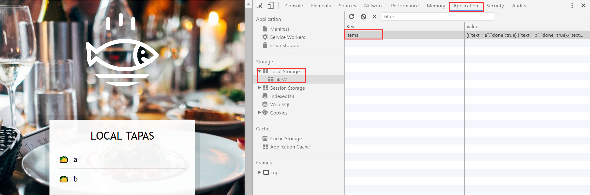

# 15 - LocalStorage 

## 任务介绍

尝试使用localStorage对数据进行本地存储

## 效果预览

[点击查看效果](https://miraclezys.github.io/JavaScript30/15%20-%20LocalStorage/index-ME.html)

如果在页面中填写了数据，重新进入页面或刷新页面，填写的数据依然存在哦。

## 相关知识点

* [Storage](https://developer.mozilla.org/zh-CN/docs/Web/API/Storage)
* [Window.localStorage](https://developer.mozilla.org/zh-CN/docs/Web/API/Window/localStorage)

## 步骤

1. 获取在`localStorage`上存储的数据，存入`items`中

   ```javascript
   const items = JSON.parse(localStorage.getItem("items")) || [];
   ```

2. 根据`items`的值，更新页面中的列表，即调用函数`populateList()`

3. 当对表单`addItems`输入数据提交时，需要向`items`添加数据

   即给表单`addItems`添加事件`submit`事件，当事件触发时执行函数`addItem()`

   1. 首先我们需要使用`event.preventDefalt()` ，阻止原本表单提交时刷新页面的操作
   2. 数组`items`存储的是用户已输入的数据，`items`中的每一项应该包含两个属性：
      * `text` ：该项`item`的数据
      * `done` ：该项`item`是否被打钩了
   3. 获取用户提交的数据，并添加到`items`中
   4. 更新页面中显示的列表，即调用函数`populateList()`
   5. 将数据重新存入`localStorage` 
   6. 重置表单

   ```javascript
   function addItem(event) {
       event.preventDefault();
       let item = {
         text: document.querySelector('input[type="text"]').value,
         done: false
       }
       items.push(item);
       populateList();
       localStorage.setItem("items", JSON.stringify(items));
       this.reset();
   }
   ```

4. 实现函数`populateList()`

   显示列表中的每一项，有一个`<input type="checkbox">`和`<label>`组成的：

   ```javascript
   itemsList.innerHTML = items.map((item, index) => {
       return `
          <li>
          		<input type="checkbox" id="item${index}" data-index=${index} ${item.done ? 'checked' : ''}>
             	<label for="item${index}">${item.text}</label>
          </li>
          `
   }).join('');
   ```

   我们给每个`<input type="checkbox">`设置了`id`是因为这样点击`label`，就会选中对应的`<input>`了。然后给每个`<input type="checkbox">`设置`data-index`属性是便于之后函数`toggleDone()`的实现，便于知道的被点击的`<input>`对应`items`中的哪一项。然后就是通过`item.done`属性的值来判断该`<input>`是否被选中了。

5. 给显示列表`itemsList`的事件`click`添加监听器，当点击了列表，执行函数`toggleDone()`，更新对应`<input type="checkbox">`的点击状态

   1. 由于监听器是设在显示列表`itemsList` ，当点击其中一个`<input>`时，或点击其中一个`<label>`时，会造成两次触发，一次`event.target`是`<input>` ，一次`event.target`是`<label>` 。因为我们需要修改的是`<input>`的状态，所以我们需要排除`<label>`触发的事件：

      ```javascript
      if(!event.target.matches("input"))return;
      ```

   2. 通过`event.target.dataset.index`获取该点击的`<input>`位于`items`中的哪一项，更新`items[index].done`的值

   3. 更新`localStorage`中存储的值

   4. 更新显示列表

   ```javascript
   function toggleDone(event) {
       if(!event.target.matches("input"))return;
       let index = event.target.dataset.index;
       items[index].done = !items[index].done;
       localStorage.setItem("items", JSON.stringify(items));
       populateList();
   }
   ```


## 小tips

1. 如何查看页面上存储的`localStorage`？

   开发者工具->Application->Local Storage

   

2. 为什么是给显示列表添加事件监听器，而不是给每个`<input>`添加监听器呢？

   1. 当`<input>`个数非常多的时候，比如个数为10000个，那么需要创建10000个事件监听器，然后把他们添加到DOM上，这样做的效率非常低
   2. 如果我们一开始给每个`<input>`添加了事件监听器，当我们重新添加新的`<input>`的时候，又要重新给每个`<input>`添加监听器了，不但没有效率，还挺麻烦的

   所以给显示列表添加事件监听器，就大大提高了效率了：

   ```javascript
   itemsList.addEventListener('click', toggleDone);

   function toggleDone(event) {
       if(!event.target.matches("input"))return;
       let index = event.target.dataset.index;
       items[index].done = !items[index].done;
       localStorage.setItem("items", JSON.stringify(items));
       populateList();
   }
   ```

   ​