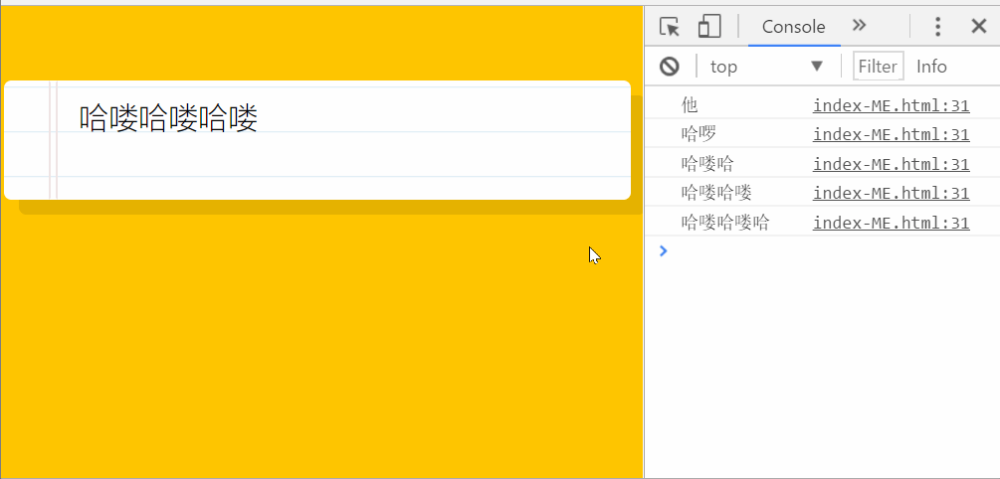
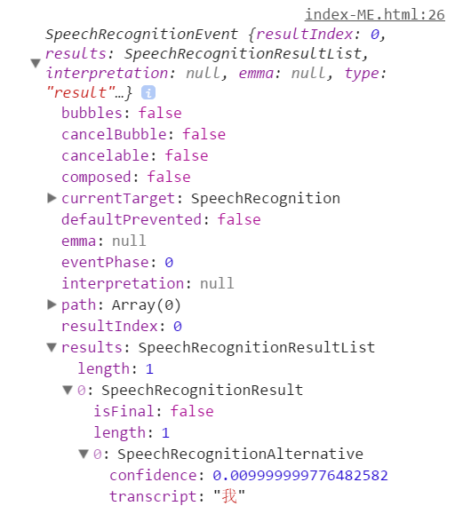

# 20 - Speech Detection  

## 任务介绍

实现对着麦克风说话时，浏览器屏幕语音识别出说话的内容

## 效果预览

[点击查看效果](https://miraclezys.github.io/JavaScript30/20%20-%20Speech%20Detection/index-ME.html)



## 相关知识点

* [SpeechRecognition()](https://developer.mozilla.org/en-US/docs/Web/API/SpeechRecognition/SpeechRecognition)
* [HTML5语音合成Speech Synthesis API简介](http://www.zhangxinxu.com/wordpress/2017/01/html5-speech-recognition-synthesis-api/)

## 步骤

1. 创建`SpeechRecognition`的实例

   ```javascript
   window.SpeechRecognition = window.SpeechRecognition || window.webkitSpeechRecognition;
   const recognition = new SpeechRecognition();
   ```

2. 设置`SpeechRecognition.interimResults`的值为`true`，表示持续接听声音，随着输入，语音识别结果可能有所改变

   > The **interimResults** property of the [`SpeechRecognition`](https://developer.mozilla.org/en-US/docs/Web/API/SpeechRecognition) interface controls whether interim results should be returned (`true`) or not (`false`.) 

   ```javascript
   recognition.interimResults = true;
   ```

3. 创建元素`<p>`用于保存结果

   ```javascript
   let p = document.createElement('p');
   const words = document.querySelector('.words');
   words.appendChild(p);
   ```

4. 语音识别开始。当语音识别连接中断时，重新开始语音识别

   ```javascript
   recognition.addEventListener('end', recognition.start);
   recognition.start();
   ```

5. 当语音识别返回一个结果时，对结果进行处理，将结果呈现在浏览器窗口上

   首先我们给`recognition`添加`result`事件监听器，当语音识别返回结果时，我们就对结果进行处理

   ```javascript
   recognition.addEventListener('result', event => {});
   ```

   我们将`event`输出出来看一下：

   

   可以看到语音识别的结果在`results`的`transcript`中。可以从效果预览那里看到，随着我们讲话，语音识别会一直进行更新。

   那么我们想要获取语音识别结果，就需要获取`transcript`属性中的值：

   ```javascript
   const transcript = Array.from(event.results)
         .map(result => result[0])
         .map(result => result.transcript)
         .join(' ');
   ```

   然后将结果作为`<p>`元素的文本内容：

   ```javascript
   p.textContent = poopScript;
   ```

   当该段语音识别结果已经结束，`isFinal`属性的值会为`true`，接着需要重新创建一个`p`元素，记录下次的语音识别结果：

   ```javascript
   if(event.results[0].isFinal) {
       p = document.createElement('p');
       words.appendChild(p);
   }
   ```

   完整代码：

   做了个小游戏，将语音识别中的`candy`替代为笑脸

   ```javascript
   recognition.addEventListener('result', event => {
       const transcript = Array.from(event.results)
           .map(result => result[0])
           .map(result => result.transcript)
           .join(' ');
       const poopScript = transcript.replace(/candy/gi, '😊');
       p.textContent = poopScript;

       if(event.results[0].isFinal) {
           p = document.createElement('p');
           words.appendChild(p);
       }
   });
   ```

   ​

