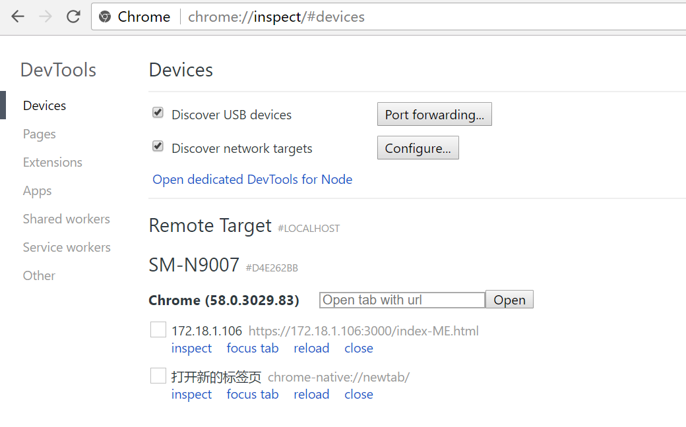
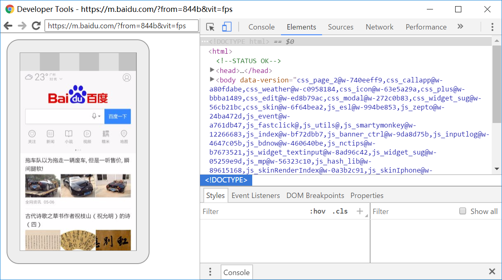

# 21 - Geolocation  

## 任务介绍

实现指南针和读取装置的速度

## 效果预览

[点击查看效果](https://miraclezys.github.io/JavaScript30/21%20-%20Geolocation/index-ME.html)

## 相关知识点

* [Geolocation.watchPosition()](https://developer.mozilla.org/zh-CN/docs/Web/API/Geolocation/watchPosition)
* [Position](https://developer.mozilla.org/zh-CN/docs/Web/API/Position)
* [Coordinates.heading](https://developer.mozilla.org/zh-CN/docs/Web/API/Coordinates/heading)

## 步骤

1. 配置本地服务器

   我们可以在文件`package.json`看到声明了项目中所使用的模块以及项目的配置信息。接着我们使用命令`npm install`来根据`package.json`文件的配置信息下载所需要的模块。

   `script`字段指定了运行脚本命令的npm命令缩写，比如start指定了运行

   `npm run start`时所要执行的命令。

   `devDependencies`字段指定了项目开发所需要的模块

   我们可以看到开发所需要的模块[`browser-sync`](http://www.browsersync.cn/)，该模块能够创建本地服务器监听多种类型的文件并且能让浏览器实时，快速响应文件的更改。

   当我们完成模块按照后，就可以使用`npm start`启动服务器进行监听了。

   ```
   npm install
   npm start
   ```

2. 监听地理位置的变化

   ```javascript
   const arrow = document.querySelector('.arrow');
   const speed = document.querySelector('.speed-value');

   navigator.geolocation.watchPosition((data) => {
       console.log(data);
       speed.textContent = data.coords.speed;
       arrow.style.transform = `rotate(${data.coords.heading}deg)`;
   }, (err) => {
     	console.error(err);
   });
   ```
   * `Geolocation.watchPosition()` 用于注册监听器，在设备的地理位置发生改变的时候自动被调用。

   * `coords.heading`來代表装置前進的方向。代表装置前进的方向。这个数值代表偏离北方多少度，0度标志正处于正北方，90度表示正东放，270度表示正西方(按照顺时针方向地震)。如果装置无法提供该值，会传回null。

   * `coords.speed`代表装置的速度，单位是米/秒。如果装置无法提供该值，会传回null。

     ​


## 问题

1. 无法查看效果？

   是的，我用了电脑，安卓手机，ipone6都无法查看效果。关于这个问题，网上有很多解释：

   [部分国行Android手机缺少谷歌GMS服务包导致HTML5 Geolocation无法定位的问题](http://blog.csdn.net/albert528108/article/details/39213419)

   [HTML5浏览器定位navigator.geolocation.getCurrentPosition无效了？](http://bbs.csdn.net/topics/390826795)

   比较多的解释是由于手机原因或网络原因，目前还没有解决这一问题

2. 如果使用手机调试页面呢？

   > [移动端Web开发调试之Chrome远程调试](http://blog.csdn.net/freshlover/article/details/42528643/)

   因为我的是安卓手机，这里就写一下安卓手机是如何调试的。

   1. 手机使用USB数据线连接到电脑，并且在 设置-开发者选项-勾选进入USB调试

      (如果没有看到开发者选项，那么在 设置-关于手机-手机配置信息-连点版本号7次，返回上级，就能看到开发者选项，然后选择勾选进入USB调试)

   2. 在电脑上打开Chrome浏览器，输入

      ```
      chrome://inspect/#devices
      ```

      就会看到如下页面：

      

      会显示连接的设备的型号，该设备已打开的网页。

      可以在Open tab wit url上输入你想在手机上打开的网页。

      * inspect：打开DevTools，就能看到手机正在运行的页面，也能选中元素查看效果

        

        (不过这一步好像需要翻墙)

      * reload：重新加载当前调试的页面

      * focus tab：可将标签页置顶

      * close：关闭当前页面

   3. 如果你想打开localhost的页面，可能发现没有办法打开，此时将localhost修改为电脑的IP地址，就能打开网页了。

   4. 可以在电脑Chrome上安装插件，使用起来更加方便

      

   ​