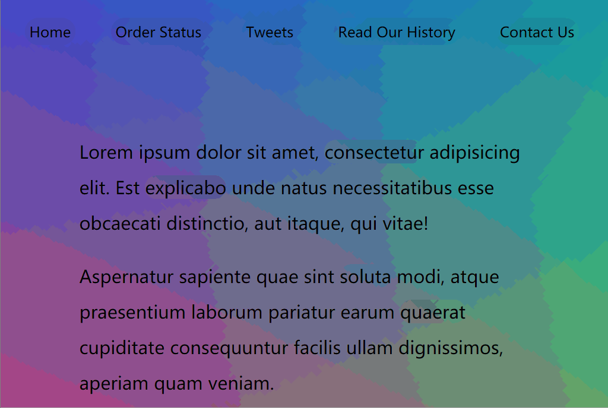

# 22 - Follow Along Link Highlighter  

## 任务介绍

实现鼠标滑动到链接时，链接高亮，从而达到链接跟踪的效果

## 效果预览

[点击查看效果](https://miraclezys.github.io/JavaScript30/22%20-%20Follow%20Along%20Link%20Highlighter/index-ME.html)



## 相关知识点

* [Element.getBoundingClientRect()](https://developer.mozilla.org/zh-CN/docs/Web/API/Element/getBoundingClientRect)

## 步骤

1. 获取所有的链接元素

   ```javascript
   const triggers = document.querySelectorAll('a');
   ```

2. 创建使得链接高亮的元素(对应`.hightlight`的样式)

   ```javascript
   const highLight = document.createElement('span');
   highLight.classList.add('highlight');
   document.body.appendChild(highLight);
   ```

3. 给每个链接添加事件`mouseenter`的监听器，当事件触发时，执行函数`hightlightLink()`

4. 实现函数`hightlightLink()` ：根据目前鼠标所在的链接，动态修改`highLight`的宽，高和位置

   ```javascript
   function highlightLink() {
       const linkCoords = this.getBoundingClientRect();
       console.log(linkCoords);

       const coords = {
           width: linkCoords.width,
           height: linkCoords.height,
           top: linkCoords.top + window.scrollY,
           left: linkCoords.left + window.scrollX
       };

       highLight.style.width = `${coords.width}px`;
       highLight.style.height = `${coords.height}px`;
       highLight.style.transform = `translate(${coords.left}px, ${coords.top}px)`;
   }
   ```

   1. 获取当前链接的大小以及所处的位置：

      使用`getBoundingClientRect()`方法会返回一个`DOMRect`对象，该对象其实是一组矩形的集合，即与该元素相关的CSS边框集合，包换left, top, right和bottom，单位为像素。除了width和height外的属性，都是相对于视口左上角而言的。

   2. 由于`highLight`初始位置是位于视口左上角，想要其达到平移到链接的效果，需要设置`transform: translate(x, y)` 。当我们滑动了滚动条时，使用`getBoundingClientRect()`读取的元素的`left`和`top`的值是相对于视口的，所以此时我们需要给`highLight`的`transform: translate(x, y)`的x和y分别加上`scrollX`和`scrollY`才能正确定位到链接。

   3. 动态定义`highLight`的大小和位置

