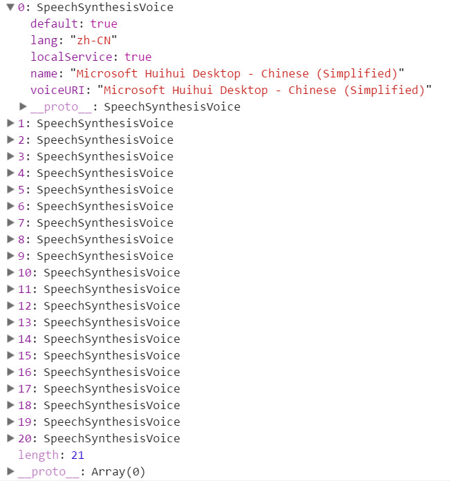

# 23 - Speech Synthesis  

## 任务介绍

实现语音合成，可以修改语音类型，合成语音的文字，修改语音的播放速度和音高。点击play和stop按钮时，分别播放和停止播放语音。

## 效果预览

[点击查看效果](https://miraclezys.github.io/JavaScript30/23%20-%20Speech%20Synthesis/index-ME.html)

## 相关知识点

* [SpeechSynthesis](https://developer.mozilla.org/zh-CN/docs/Web/API/SpeechSynthesis)
* [SpeechSynthesisUtterance](https://developer.mozilla.org/en-US/docs/Web/API/SpeechSynthesisUtterance)
* [HTML5语音合成Speech Synthesis API简介](http://www.zhangxinxu.com/wordpress/2017/01/html5-speech-recognition-synthesis-api/)

## 步骤

1. 获取浏览器支持的语音列表并显示出来：`populateVoices()`

   ```javascript
   function populateVoices() {
       voices = this.getVoices();
       //console.log(voices);
       voicesDropdown.innerHTML = voices
         .map(voice => `<option value="${voice.name}">${voice.name} (${voice.lang})</option>`)
         .join('');
   }
   speechSynthesis.addEventListener('voiceschanged', populateVoices);
   ```

   `speechSynthesis`对象的`getVoices()`方法能够获取浏览器支持的语音列表：

   

   给`speechSynthesisi`对象添加事件`omvoiceschange`监听器，当发生以下情况时：

   > This may occur when speech synthesis is being done on the server-side and the voices list is being determined asynchronously, or when client-side voices are installed/uninstalled while a speech synthesis application is running.

   就会触发函数`populateVoices()`，更新显示的语音列表。

2. 实现函数`toggle()` ：从会话列表中移除所有语音，表现是暂停播放现在的语音，接着默认在会话列表中添加一个语音，接着该语音会被播放出来。

   ```javascript
   function toggle(startOver = true) {
       speechSynthesis.cancel();
       if(startOver) {
         	speechSynthesis.speak(msg);
       }
   }
   ```

3. 当用户选择了一种语音类型时，设置该语音并进行播放，`setVoice()`：

   ```javascript
   const msg = new SpeechSynthesisUtterance();
   msg.text = document.querySelector('[name="text"]').value;

   function setVoice() {
       msg.voice = voices.find(voice => voice.name === this.value);
       toggle();
   }

   voicesDropdown.addEventListener('change', setVoice);
   ```

   `msg`是`SpeechSynthesisUtterance`对象，该对象主要用来构建语音合成实例。`msg.text`是指要合成的文字内容，`msg.voice`指要合成的声音使用的语音类型。

   当用户选择了一种语音类型，就会触发函数`setVoice()` ，重新设定`msg`的语音类型，并且暂停现在播放的声音，播放新选择的语音类型。

4. 修改合成语音的音速，音高，合成的文字内容，`setOption()` ：

   ```javascript
   function setOption() {
       msg[this.name] = this.value;
       toggle();
   }

   options.forEach(option => option.addEventListener('change', setOption));
   ```

5. 当点击`speak`按钮时，播放合成语音。当点击`stop`按钮时，停止播放语音：

   ```javascript
   speakButton.addEventListener('click', toggle);
   stopButton.addEventListener('click', () => toggle(false));
   ```

   ​

