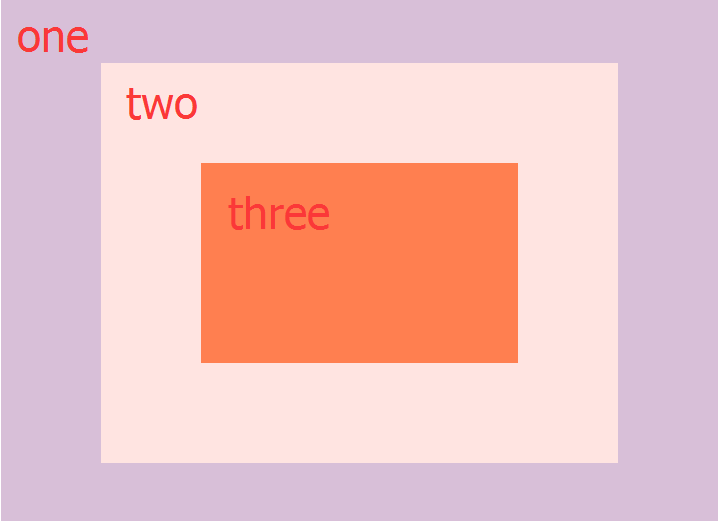

# 25 - Event Capture, Propagation, Bubbling and Once  

## 任务介绍

理解事件冒泡，事件捕获，以及once

## 效果预览

[点击查看效果](https://miraclezys.github.io/JavaScript30/25%20-%20Event%20Capture%2C%20Propagation%2C%20Bubbling%20and%20Once/index-ME.html)

## 相关知识点

* [Event order](https://www.quirksmode.org/js/events_order.html#link4)
* [事件流](https://developer.mozilla.org/zh-CN/docs/Web/API/EventTarget/addEventListener)
* [EventTarget.addEventListener()](https://developer.mozilla.org/zh-CN/docs/Web/API/EventTarget/addEventListener)
* [An Introduction To DOM Events](https://www.smashingmagazine.com/2013/11/an-introduction-to-dom-events/)
* [DOM事件简介](http://blog.jobbole.com/52430/)
* [event.stopPropagation](https://developer.mozilla.org/zh-CN/docs/Web/API/Event/stopPropagation)

## 总结

1. DOM事件流

   

   当一个DOM事件触发时，会经历三个阶段：

   1. 第一阶段：事件捕获阶段(Capture Phase)

      事件会从文档的根节点出发，随着DOM树的结构向事件目标节点流去。在途经的各个层次的DOM节点，会在节点上触发对应的捕获事件处理程序，直到到达目标节点。

      该阶段建立的传播路径，在冒泡阶段，事件会通过该路径传播到文档的根节点

   2. 第二阶段：目标阶段(Target Phase)

      当事件到达目标节点，事件就进入了目标阶段。目标节点上的事件处理程序会被触发。

   3. 第三阶段：冒泡阶段(Bubble Phase)

      目标节点上的事件处理程序会被触发后，接着会随着DOM树一层层向上冒泡，直到到达根节点。在途经的各个层次的DOM节点，会在节点上触发对应的捕获事件处理程序。

2. 事件冒泡

   ```html
   <div class="one">
       <div class="two">
           <div class="three">
           </div>
       </div>
   </div>
   ```

   结构如下：

   

   ```javascript
   const divs = document.querySelectorAll('div');

       function logText(event) {
         	console.log(this.classList.value);
       }

   divs.forEach(div => div.addEventListener('click', logText));
   ```

   点击`three`，控制台输出的结果：

   ```javascript
   1. three
   2. two
   3. one
   ```

   可以看到事件的传播顺序是根据事件冒泡传播的，首先是`three`，然后是`three`的父节点`two`，然后是`two`的父节点`one`

   这是因为`addEventListener()`的第三个参数`useCapture`默认为`false`，即事件在冒泡阶段执行。

3. 事件捕获

   现在我们将`addEventListener()`的第三个参数修改为`true`

   ```javascript
   const divs = document.querySelectorAll('div');

       function logText(event) {
         	console.log(this.classList.value);
       }

   divs.forEach(div => div.addEventListener('click', logText, true));
   ```

   点击`three`，控制台输出的结果：

   ```javascript
   1. one
   2. two
   3. three
   ```

   可以看到事件的传播顺序是根据事件捕获传播的，首先是`one`，然后是`one`的子节点`two`，然后是`two`的子节点`three`

4. 阻止事件传播

   ```javascript
   const divs = document.querySelectorAll('div');

       function logText(event) {
         	console.log(this.classList.value);
         	event.stopPropagation();
       }

   divs.forEach(div => div.addEventListener('click', logText));
   ```

   点击`three`，控制台输出的结果：three

   点击`two`，控制台输出的结果：two

   点击`one`，控制台输出的结果：one

   因为`event.stopPropagation()`阻止捕获和冒泡阶段中当前事件的进一步传播。

   如果将`addEventListener()`的第三个参数修改为`true`

   ```javascript
   const divs = document.querySelectorAll('div');

       function logText(event) {
         	console.log(this.classList.value);
         	event.stopPropagation();
       }

   divs.forEach(div => div.addEventListener('click', logText));
   ```

   无论是点击`one`，`two`，`three`，都只会输出one

5. once

   `addEventListener()`的`options`参数的`once`属性为`true`时，表示事件的触发函数在添加之后，最多只调用一次，该触发函数被调用之后，就会自动移除。

   ```javascript
   const divs = document.querySelectorAll('div');

   function logText(event) {
   	console.log(this.classList.value);
   }

   divs.forEach(div => div.addEventListener('click', logText, {
   	capture: false,
   	once: true
   }));
   ```

   `capture: false`指的是事件的传播顺序是根据事件冒泡传播

   当点击`three`时，控制台输出的结果是：

   ```javascript
   1. one
   2. two
   3. three
   ```

   当再点击`three`时，就不会有任何输出结果了，因为`once: true`，触发函数只会被调用了一次

   ​

   ​

