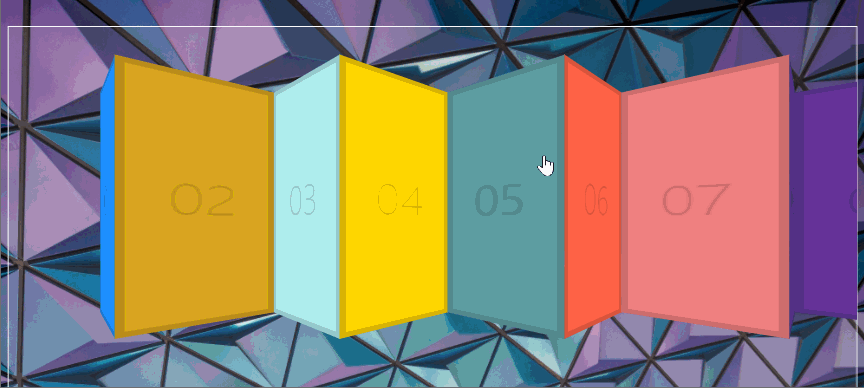

# 27 - Click and Drag  

## 任务介绍

实现点击拖拽可翻页面

## 效果预览

[点击查看效果](https://miraclezys.github.io/JavaScript30/27%20-%20Click%20and%20Drag/index-ME.html)



## 相关知识点

* [MouseEvent.pageX](https://developer.mozilla.org/en-US/docs/Web/API/MouseEvent/pageX)
* [Element.scrollLeft](https://developer.mozilla.org/zh-CN/docs/Web/API/Element/scrollLeft)

## 步骤

1. 相关变量准备

   ```javascript
   const slider = document.querySelector('.items');
   let isDown = false;
   let startX;
   let scrollLeft;
   ```

   * `isDown`是记录鼠标是否按下了
   * `startX`是记录鼠标按下时鼠标距离`slider`左边界的距离
   * `scrollLeft`是记录`slider`当前滚动条到元素左边的距离

2. 事件`mousemove`

   ```javascript
   slider.addEventListener('mousedown', (event) => {
       isDown = true;
       slider.classList.add('active');
       startX = event.pageX - slider.offsetLeft;
       scrollLeft = slider.scrollLeft;
   });
   ```

   1. 当鼠标在`slider`上按下时，设置`isDown`为true。
   2. 给`slider`的`classList`添加`active`的`class`，用于设置鼠标按下的相关样式
   3. 设置`startX`的值，记录鼠标按下时鼠标距离`slider`左边界的距离，也就是鼠标当前相对于文档左边界的距离减去`slider`距离文档左边的距离。
   4. 设置`scrollLeft`的值，记录`slider`当前滚动条到元素左边的距离

3. 事件`mouseleave`

   ```javascript
   slider.addEventListener('mouseleave', () => {
       isDown = false;
       slider.classList.remove('active');
   });
   ```

4. 事件`mouseup`

   ```javascript
   slider.addEventListener('mouseup', () => {
       isDown = false;
       slider.classList.remove('active');
   });
   ```

5. 事件`mousemove`

   ```javascript
   slider.addEventListener('mousemove', (event) => {
       if(!isDown) return;
       event.preventDefault();
       const x = event.pageX - slider.offsetLeft;
       const walk = (x - startX) * 2;
       slider.scrollLeft = scrollLeft - walk;
   });
   ```

   1. 如果`isDown`的值不为`true`，返回，因为这代表鼠标没有被按下
   2. 取消事件的默认操作
   3. `x`的值表示当前鼠标距离`slider`左边的距离
   4. `walk`表示希望移动`slider`的长度，`*2`是想一次移动的效果更明显，长度更长，该数值可以自行修改
   5. 设置`slider.scrollLeft`的值，即设置`slider`的滚动条距离元素左边的距离为：初始`slider`的滚动条距离元素左边的距离加上希望移动的距离，设置之后就会形成滚动效果啦

