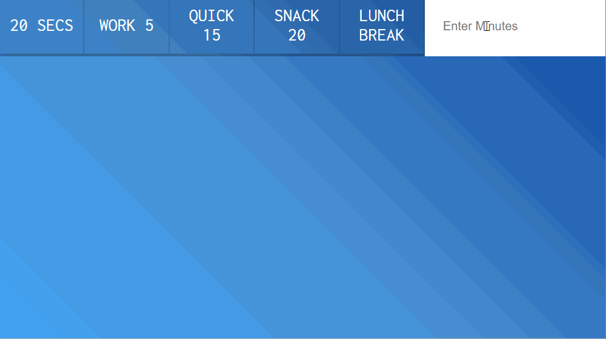

# 29 - Countdown Timer  

## 任务介绍

实现倒计时

## 效果预览

[点击查看效果](https://miraclezys.github.io/JavaScript30/29%20-%20Countdown%20Timer/index.html)



## 步骤

1. 实现倒计时，函数`timer()`

   ```javascript
   function timer(seconds) {
       clearInterval(countdown);
       const now = Date.now();
       const then = now + seconds * 1000;
       displayTimeLeft(seconds);
       displayEndTime(then);
       countdown = setInterval(() => {
           const secondsLeft = Math.round((then - Date.now()) / 1000);
           if(secondsLeft < 0) {
               clearInterval(countdown);
               return;
           }
           displayTimeLeft(secondsLeft);
       }, 1000);
   }
   ```

   首先每次调用`timer()`函数时取消原本已设置的定时器，这是为了避免在重新设置定时器时，原有定时器还存在的情况。

2. 实现显示倒计时，函数`displayTimeLeft()`

   ```javascript
   function displayTimeLeft(seconds) {
       const minutes = Math.floor(seconds / 60);
       const remainderSeconds = seconds % 60;
       const display = `${minutes}:${remainderSeconds < 10 ? 0 : ''}${remainderSeconds}`;
       display.title = display;
       timerDisplay.textContent = display;
   }
   ```

3. 显示倒计时结束时间

   ```javascript
   function displayEndTime(seconds) {
       const end = new Date(seconds);
       const hour = end.getHours();
       const adjustedHour = hour > 12 ? hour - 12 : hour;
       const minutes = end.getMinutes();
       endTime.textContent = `Be back At ${adjustedHour}:${minutes < 10 ? '0' : ''}${minutes}`;
   }
   ```

4. 给`button`添加`click`事件监听器，当事件触发时，倒计时`button`对应的`data-time`的数值

   ```javascript
   function startTime() {
       const seconds = parseInt(this.dataset.time);
       timer(seconds);
   }

   buttons.forEach(button => button.addEventListener('click', startTime));
   ```

5. 实现在输入框输入倒计时的分钟数，实现倒计时

   ```javascript
   document.customForm.addEventListener('submit', function(event){
       event.preventDefault();
       const mins = this.minutes.value;
       timer(mins * 60);
       this.reset();
   });
   ```

   ​

