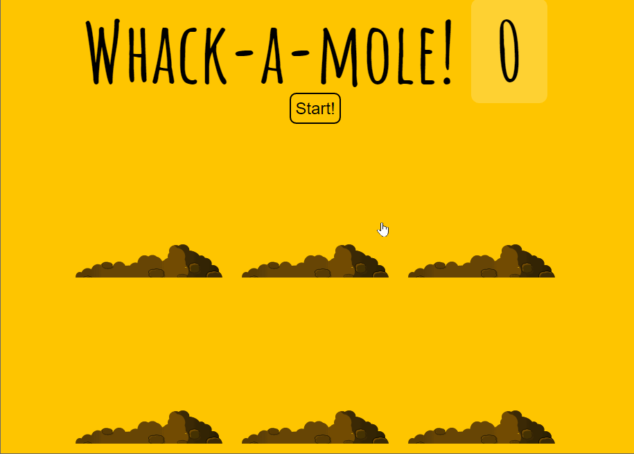

# 30 - Whack A Mole  

## 任务介绍

实现倒计时

## 效果预览

[点击查看效果](https://miraclezys.github.io/JavaScript30/30%20-%20Whack%20A%20Mole/index-ME.html)



## 步骤

1.  老鼠随机出现

   ```javascript
   function randomTime(min, max) {
     	return Math.round(Math.random() * (max - min) + min);
   }

   function randomHole(holes) {
       const idx = Math.floor(Math.random() * holes.length);
       const hole = holes[idx];
       if(hole === lastHole) {
         return randomHole(holes);
       }
       lastHole = hole;
       return hole;
   }

   function peep() {
       const time = randomTime(500, 1500);
       const hole = randomHole(holes);
       hole.classList.add('up');
       setTimeout(() => {
         hole.classList.remove('up');
         if(!timeUp) peep();
       }, time);
   }
   ```

   首先实现函数`randomTine()`得出每次老鼠随机出现的时间，实现函数`randomHoles()`得出每次老鼠随机出现在哪个洞。然后给对应的`hole`的`clssList`添加`up`，就会在该洞出现老鼠。时间到了，就移除`up`，老鼠就会消失。如果游戏时间还未结束，即继续调用函数`peep()`，随机出现老鼠。

2. 分数计算

   ```javascript
   function bonk(event) {
       if(!event.isTrusted) return;
       score++;
       this.classList.remove('up');
       scoreBoard.textContent = score;
   }

   moles.forEach(mole => mole.addEventListener('click', bonk));
   ```

   `event.isTrusted`的值如果为`true`，表明`click`事件是由用户行为触发的。

   当用户点击了出现的老鼠，就加一分，并且点击之后，让该老鼠消失。

3. 开始游戏

   ```javascript
   function startGame() {
       scoreBoard.textContent = 0;
       timeUp = false;
       score = 0;
       peep();
       setTimeout(() => timeUp = true, 15000);
   }
   ```

   将分数重新设为0，如果游戏时间到了，将`timeUp`设为`true`​

